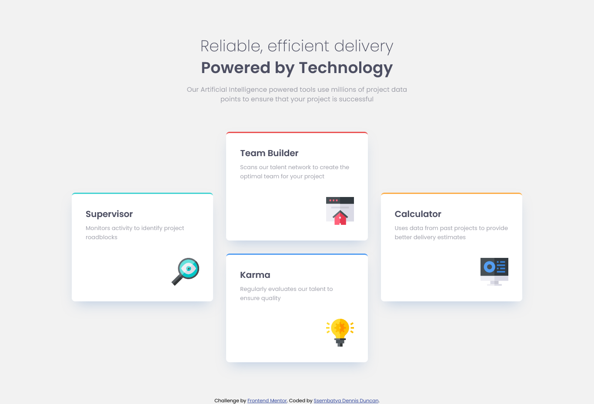
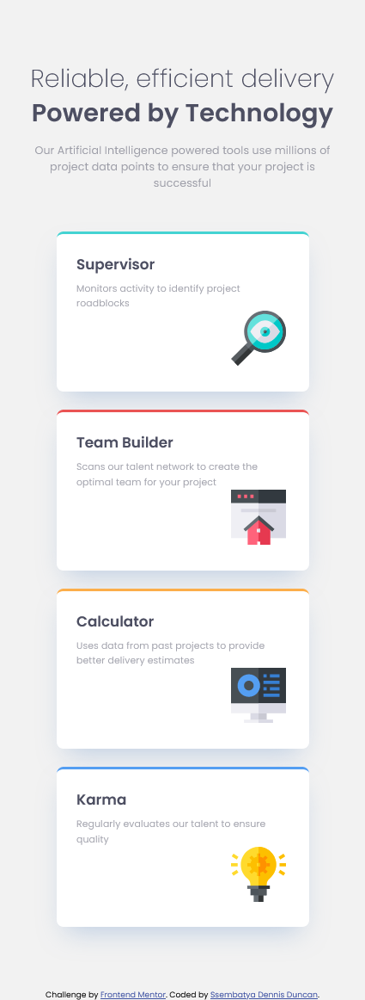

# Frontend Mentor - Four card feature section solution

This is a solution to the [Four card feature section challenge on Frontend Mentor](https://www.frontendmentor.io/challenges/four-card-feature-section-weK1eFYK). Frontend Mentor challenges help you improve your coding skills by building realistic projects.

## Overview

- The Four card feature section challenge on Frontend Mentor is a nice layout-based challenge for beginners. This will test anyone who is new to multi-column and responsive layouts.

### The challenge

Users should be able to:

- View the optimal layout for the site depending on their device's screen size

### Screenshot

- Desktop view
  

### Links

- Solution URL: [Four card feature section challenge on Frontend Mentor](https://www.frontendmentor.io/solutions/responsive-four-card-feature-section-Q_NSalcd0I)
- Live Site URL: [Four card feature section challenge #live site](https://four-card-feature-section-pi-ecru.vercel.app/)

### Built with

- Semantic HTML5 markup
- CSS custom properties
- Flexbox
- CSS Grid

### Continued development

I continued to learn about the CSS Grid but now with a heavy focus on the **How to position items horizontally and vertically in a CSS Grid Container.**

## Author

- Frontend Mentor - [@ssembatya-dennis](https://www.frontendmentor.io/profile/ssembatya-dennis)
- Twitter - [@DennisSsembatya](https://twitter.com/DennisSsembatya)
